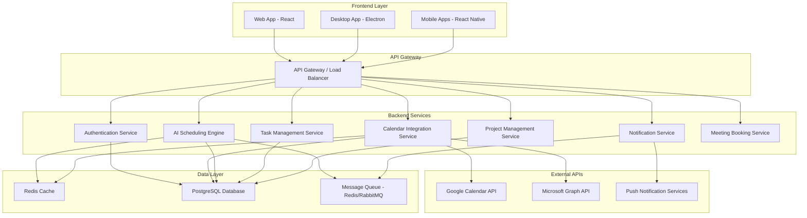

# Design Document

## Overview

Momentum is an AI-powered calendar and task management system designed to eliminate the cognitive load of manual planning by consolidating a user's entire digital life into a single, optimized, and dynamically adjusting schedule. The core principle is that if something isn't on the calendar, it doesn't get done - the AI's primary job is to find optimal time for every task and automatically block it out on the user's schedule. The system integrates with external calendars (Google Calendar and Microsoft 365), automatically schedules tasks using sophisticated AI algorithms, and provides real-time dynamic rescheduling. The architecture follows a microservices pattern with cross-platform clients (web, desktop, mobile), Node.js backend services, and an intelligent AI scheduling engine.

## Architecture

### High-Level Architecture



### Technology Stack

**Frontend:**
- **Web**: React 18+ with TypeScript, Tailwind CSS, React Query for state management, comprehensive keyboard shortcuts
- **Desktop**: Electron wrapper around web app with native notifications and system integration
- **Mobile**: React Native with platform-specific optimizations, focused on daily schedule viewing and quick task addition

**Backend:**
- **Runtime**: Node.js with TypeScript
- **Framework**: Express.js with middleware for authentication, rate limiting, and logging
- **Database**: PostgreSQL for relational data with encryption at rest, Redis for caching and real-time features
- **Message Queue**: Redis Pub/Sub or RabbitMQ for async processing and rescheduling operations
- **Authentication**: JWT tokens with refresh token rotation, secure API token storage
- **Security**: End-to-end encryption for calendar data, secure transmission protocols

**AI Scheduling Engine:**
- **Algorithm**: Constraint Satisfaction Problem (CSP) solver with weighted priority optimization
- **Priority Hierarchy**: Hard Deadlines (100) > Critical Priority (80) > High Priority (60) > Soft Deadlines (40) > Medium Priority (30) > Low Priority (10)
- **Implementation**: Custom algorithm in TypeScript with fallback to simpler heuristics
- **Performance**: Sub-second rescheduling with in-memory processing and database persistence

## Components and Interfaces

### 1. Calendar Integration Service

**Purpose**: Manages bi-directional synchronization with external calendar providers.

**Key Components:**
- **Google Calendar Connector**: OAuth 2.0 integration with Google Calendar API v3
- **Microsoft Graph Connector**: OAuth 2.0 integration with Microsoft Graph API
- **Sync Manager**: Handles webhook subscriptions and polling for calendar changes
- **Conflict Resolver**: Manages conflicts between local and external calendar events

**API Interface:**
```typescript
interface CalendarIntegrationService {
  connectProvider(userId: string, provider: 'google' | 'microsoft', authCode: string): Promise<void>
  syncCalendars(userId: string): Promise<SyncResult>
  createEvent(userId: string, event: CalendarEvent): Promise<string>
  updateEvent(userId: string, eventId: string, updates: Partial<CalendarEvent>): Promise<void>
  deleteEvent(userId: string, eventId: string): Promise<void>
  subscribeToChanges(userId: string): Promise<void>
}
```

### 2. AI Scheduling Engine

**Purpose**: Core intelligence that automatically schedules tasks and handles dynamic rescheduling.

**Algorithm Design:**
The scheduling engine uses a multi-phase approach with automatic rescheduling capabilities:

1. **Constraint Collection**: Gather all constraints (working hours, lunch breaks, deadlines, dependencies, firm events, buffer times)
2. **Priority Scoring**: Calculate weighted scores based on: Hard Deadlines (100) > Critical Priority (80) > High Priority (60) > Soft Deadlines (40) > Medium Priority (30) > Low Priority (10)
3. **Time Slot Generation**: Create available time slots considering firm events, user preferences, and maximum continuous work time limits
4. **Task Chunking Logic**: Split non-blocking tasks into optimal chunks while keeping blocking tasks intact
5. **Dependency Resolution**: Ensure prerequisite tasks are scheduled before dependent tasks
6. **Optimization**: Use constraint satisfaction with backtracking to find optimal placement that groups similar tasks when preferred
7. **Validation**: Ensure all constraints are satisfied and no conflicts exist
8. **Auto-Rescheduling**: Trigger immediate rescheduling on any calendar changes with smooth UI updates

**Key Components:**
- **Constraint Solver**: CSP implementation with priority-based heuristics and dependency resolution
- **Schedule Optimizer**: Minimizes context switching, maximizes productivity blocks, and respects user energy preferences
- **Task Chunking Engine**: Intelligently splits tasks while respecting blocking constraints
- **Dependency Manager**: Handles task dependencies, prerequisite scheduling, and automatic unblocking
- **Auto-Rescheduling Engine**: Sub-second recalculation with conflict detection and user alerts
- **Progress Tracker**: Manages task completion, partial progress, and time reallocation

**API Interface:**
```typescript
interface AISchedulingEngine {
  scheduleTask(userId: string, task: Task): Promise<ScheduleResult>
  rescheduleAll(userId: string, trigger: RescheduleTrigger): Promise<ScheduleResult>
  validateSchedule(userId: string): Promise<ValidationResult>
  optimizeSchedule(userId: string, preferences: OptimizationPreferences): Promise<ScheduleResult>
  handleTaskCompletion(userId: string, taskId: string, completion: TaskCompletion): Promise<ScheduleResult>
  checkDependencies(userId: string, taskId: string): Promise<DependencyStatus>
  detectSchedulingConflicts(userId: string): Promise<ConflictReport>
}
```

### 3. Task Management Service

**Purpose**: Handles CRUD operations for tasks, projects, and their relationships.

**Key Components:**
- **Task Repository**: Database operations for task entities with completion history
- **Project Manager**: Handles project creation, task organization, and progress visualization
- **Dependency Tracker**: Manages task dependencies, blocking relationships, and automatic unblocking
- **Progress Tracker**: Handles task completion, partial progress logging, and time reallocation
- **Task Chunking Manager**: Handles splitting and merging of task time blocks

**API Interface:**
```typescript
interface TaskManagementService {
  createTask(userId: string, task: CreateTaskRequest): Promise<Task>
  updateTask(userId: string, taskId: string, updates: Partial<Task>): Promise<Task>
  completeTask(userId: string, taskId: string, completionData: TaskCompletion): Promise<void>
  logPartialProgress(userId: string, taskId: string, minutesCompleted: number): Promise<Task>
  unmarkCompleted(userId: string, taskId: string): Promise<Task>
  createProject(userId: string, project: CreateProjectRequest): Promise<Project>
  setTaskDependency(userId: string, taskId: string, dependsOn: string): Promise<void>
  removeDependency(userId: string, taskId: string, dependencyId: string): Promise<void>
  getProjectProgress(userId: string, projectId: string): Promise<ProjectProgress>
}
```

### 4. Meeting Booking Service

**Purpose**: Generates and manages customizable booking links for external meeting scheduling.

**Key Components:**
- **Link Generator**: Creates unique booking URLs with custom configurations and buffer time settings
- **Availability Calculator**: Real-time availability computation considering all connected calendars and scheduled tasks
- **Booking Processor**: Handles meeting confirmations, calendar updates, and automatic rescheduling trigger
- **Preference Engine**: Intelligently suggests optimal meeting times that group meetings together and optimize user's schedule
- **Buffer Manager**: Handles before/after meeting buffer times and travel time considerations

**API Interface:**
```typescript
interface MeetingBookingService {
  createBookingLink(userId: string, config: BookingLinkConfig): Promise<BookingLink>
  getAvailability(linkId: string, dateRange: DateRange): Promise<AvailableSlot[]>
  bookMeeting(linkId: string, booking: MeetingBookingRequest): Promise<BookingConfirmation>
  updateBookingLink(userId: string, linkId: string, updates: Partial<BookingLinkConfig>): Promise<void>
}
```

### 5. Real-time Synchronization Layer

**Purpose**: Provides real-time updates across all connected clients and handles external calendar changes.

**Key Components:**
- **WebSocket Manager**: Maintains persistent connections with clients
- **Event Broadcaster**: Distributes schedule changes to relevant clients
- **Webhook Handler**: Processes external calendar change notifications
- **Sync Coordinator**: Orchestrates complex multi-service updates

## User Interface Design

### Design Philosophy
The interface follows a calm, uncluttered design philosophy to reduce anxiety and cognitive load. The primary focus is on the calendar view with intelligent defaults and minimal user intervention required.

### Core Interface Components

**Calendar View:**
- **Default View**: Multi-day view (Day/Week/Month) as the central focus
- **Visual Differentiation**: Clear distinction between firm events (external calendar) and flexible AI-scheduled tasks
- **Smooth Transitions**: Non-jarring updates during real-time rescheduling
- **Color Coding**: Project-based colors with calm palette

**Task Management Panel:**
- **Persistent Sidebar**: Always-visible unscheduled tasks panel
- **Drag-and-Drop**: Intuitive task manipulation with visual feedback
- **Quick Add**: Streamlined task creation with smart defaults
- **Progress Indicators**: Visual progress tracking for tasks and projects

**Keyboard Shortcuts:**
- **Navigation**: Arrow keys for calendar navigation, Tab for focus management
- **Quick Actions**: Ctrl+N (new task), Ctrl+E (edit), Space (complete task)
- **View Switching**: 1-4 keys for different calendar views
- **Search**: Ctrl+F for quick task/event finding

**Onboarding Experience:**
- **Guided Setup**: Step-by-step calendar connection and preference setting
- **AI Explanation**: Clear explanation of automated scheduling benefits
- **Interactive Tutorial**: Hands-on demonstration of key features

### Platform-Specific Adaptations

**Web Application:**
- **Responsive Design**: Optimized for desktop and tablet viewing
- **Full Feature Set**: Complete functionality with advanced keyboard shortcuts
- **Real-time Updates**: WebSocket-powered live synchronization

**Desktop Application (Electron):**
- **Native Integration**: System notifications and menu bar presence
- **Offline Capability**: Cached data for offline viewing
- **System Shortcuts**: Global hotkeys for quick task addition

**Mobile Applications:**
- **Focused Interface**: Emphasis on daily schedule viewing and quick task addition
- **Touch Optimized**: Large touch targets and swipe gestures
- **Offline Support**: Essential data cached for offline access
- **Quick Actions**: Swipe-to-complete and voice-to-text task creation

### Accessibility Considerations
- **Screen Reader Support**: Full ARIA labeling and semantic HTML
- **Keyboard Navigation**: Complete keyboard accessibility
- **High Contrast**: Support for high contrast themes
- **Font Scaling**: Responsive to system font size preferences

## Data Models

### Core Entities

```typescript
interface User {
  id: string
  email: string
  name: string
  timezone: string
  workingHours: WorkingHours
  preferences: UserPreferences
  connectedCalendars: CalendarConnection[]
  createdAt: Date
  updatedAt: Date
}

interface Task {
  id: string
  userId: string
  projectId?: string
  title: string
  description?: string
  duration: number // minutes
  priority: 'low' | 'medium' | 'high' | 'critical'
  deadline?: Date
  isHardDeadline: boolean // distinguishes hard vs soft deadlines
  isBlocking: boolean // cannot be split into chunks
  dependencies: string[] // task IDs this task depends on
  dependents: string[] // task IDs that depend on this task
  status: 'pending' | 'scheduled' | 'in_progress' | 'completed' | 'blocked'
  completedMinutes: number
  remainingMinutes: number // calculated field: duration - completedMinutes
  scheduledSlots: ScheduledSlot[]
  completionHistory: TaskCompletionEntry[]
  createdAt: Date
  updatedAt: Date
  completedAt?: Date
}

interface Project {
  id: string
  userId: string
  name: string
  description?: string
  color: string
  tasks: string[] // task IDs
  createdAt: Date
  updatedAt: Date
}

interface CalendarEvent {
  id: string
  userId: string
  externalId?: string // ID from external calendar
  title: string
  description?: string
  startTime: Date
  endTime: Date
  isFlexible: boolean // can be moved by AI
  travelTimeBefore?: number // minutes
  travelTimeAfter?: number // minutes
  source: 'momentum' | 'google' | 'microsoft'
  createdAt: Date
  updatedAt: Date
}

interface ScheduledSlot {
  id: string
  taskId: string
  startTime: Date
  endTime: Date
  duration: number // minutes
  isConfirmed: boolean
}

interface BookingLink {
  id: string
  userId: string
  title: string
  duration: number // minutes
  availabilityWindow: AvailabilityWindow
  bufferBefore: number // minutes
  bufferAfter: number // minutes
  isActive: boolean
  customUrl?: string
  createdAt: Date
  updatedAt: Date
}
```

### Supporting Types

```typescript
interface WorkingHours {
  monday: TimeRange
  tuesday: TimeRange
  wednesday: TimeRange
  thursday: TimeRange
  friday: TimeRange
  saturday?: TimeRange
  sunday?: TimeRange
  lunchBreak?: TimeRange
}

interface TimeRange {
  start: string // HH:mm format
  end: string // HH:mm format
}

interface UserPreferences {
  maxContinuousWorkTime: number // minutes
  preferredBreakDuration: number // minutes
  groupSimilarTasks: boolean
  protectFocusTime: boolean
  optimizeForEarlyCompletion: boolean
  defaultMeetingBuffer: number // minutes before/after meetings
  energyPreferences: EnergyPreferences // preferred times for different work types
  autoRescheduleEnabled: boolean
  notificationSettings: NotificationSettings
}

interface AvailabilityWindow {
  daysOfWeek: number[] // 0-6, Sunday = 0
  timeRange: TimeRange
  advanceBookingDays: number
  maxBookingsPerDay?: number
}

interface TaskCompletionEntry {
  timestamp: Date
  minutesLogged: number
  notes?: string
  wasPartialCompletion: boolean
}

interface EnergyPreferences {
  highEnergyTimes: TimeRange[] // best times for critical/complex tasks
  lowEnergyTimes: TimeRange[] // suitable for low priority tasks
  meetingPreferredTimes: TimeRange[] // preferred times for meetings
}

interface NotificationSettings {
  taskReminders: boolean
  scheduleChanges: boolean
  deadlineAlerts: boolean
  completionCelebrations: boolean
}

interface ProjectProgress {
  totalTasks: number
  completedTasks: number
  totalMinutes: number
  completedMinutes: number
  estimatedCompletion: Date
}
```

## Error Handling

### Error Categories

1. **External API Errors**: Calendar API failures, rate limiting, authentication issues
2. **Scheduling Conflicts**: Impossible scheduling scenarios, constraint violations, insufficient time before deadlines
3. **Data Consistency**: Sync conflicts, concurrent modification issues, dependency cycles
4. **Performance Issues**: Timeout errors, memory constraints during optimization
5. **User Input Errors**: Invalid task configurations, conflicting preferences
6. **Dependency Errors**: Circular dependencies, orphaned dependent tasks

### Error Handling Strategy

```typescript
interface ErrorResponse {
  code: string
  message: string
  details?: any
  suggestions?: string[]
  retryable: boolean
}

// Example error codes
enum ErrorCodes {
  CALENDAR_SYNC_FAILED = 'CALENDAR_SYNC_FAILED',
  SCHEDULING_IMPOSSIBLE = 'SCHEDULING_IMPOSSIBLE',
  INSUFFICIENT_TIME = 'INSUFFICIENT_TIME',
  DEPENDENCY_CYCLE = 'DEPENDENCY_CYCLE',
  EXTERNAL_API_LIMIT = 'EXTERNAL_API_LIMIT',
  DEADLINE_CONFLICT = 'DEADLINE_CONFLICT',
  TASK_DEPENDENCY_ORPHANED = 'TASK_DEPENDENCY_ORPHANED',
  BOOKING_LINK_UNAVAILABLE = 'BOOKING_LINK_UNAVAILABLE'
}
```

**Recovery Mechanisms:**
- **Graceful Degradation**: Fall back to simpler scheduling when complex optimization fails
- **Retry Logic**: Exponential backoff for transient external API failures
- **User Guidance**: Provide specific suggestions when scheduling conflicts occur, including deadline extension recommendations
- **Rollback Capability**: Ability to revert to previous schedule state on critical failures
- **Intelligent Alerts**: Proactive warnings when tasks cannot fit before deadlines with actionable alternatives
- **Dependency Resolution**: Automatic cleanup of orphaned dependencies when prerequisite tasks are deleted

## Testing Strategy

### Unit Testing
- **Coverage Target**: 90%+ for core scheduling algorithms and business logic
- **Framework**: Jest with TypeScript support
- **Focus Areas**: Scheduling engine, constraint validation, data transformations

### Integration Testing
- **External APIs**: Mock Google Calendar and Microsoft Graph APIs
- **Database**: Use test database with realistic data scenarios
- **Real-time Features**: Test WebSocket connections and event broadcasting

### End-to-End Testing
- **Framework**: Playwright for web app, Detox for mobile apps
- **Scenarios**: Complete user workflows from task creation to scheduling
- **Performance**: Load testing with realistic user data volumes

### AI Algorithm Testing
- **Constraint Validation**: Verify all scheduling constraints are respected
- **Optimization Quality**: Measure schedule efficiency and user satisfaction metrics
- **Edge Cases**: Test with extreme scenarios (overloaded schedules, complex dependencies)

## Performance Considerations

### Scheduling Engine Optimization
- **Caching**: Cache frequently accessed user preferences and constraints
- **Incremental Updates**: Only recalculate affected portions of schedule during changes
- **Background Processing**: Use message queues for non-urgent rescheduling operations
- **Algorithm Complexity**: Target O(n log n) for typical scheduling operations

### Database Performance
- **Indexing Strategy**: Optimize queries for user-specific data access patterns
- **Connection Pooling**: Efficient database connection management
- **Read Replicas**: Separate read/write operations for better performance
- **Data Archival**: Archive completed tasks and old events to maintain performance

### Real-time Performance
- **WebSocket Optimization**: Efficient message batching and compression
- **Client-side Caching**: Reduce server requests through intelligent caching
- **Progressive Loading**: Load critical schedule data first, details on demand
- **Offline Capability**: Cache essential data for offline viewing on mobile

### Scalability Targets
- **Response Time**: < 200ms for scheduling operations, < 50ms for data retrieval, near-instantaneous feel for users
- **Rescheduling Performance**: Sub-second automatic rescheduling with smooth UI transitions
- **Concurrent Users**: Support 10,000+ concurrent users per server instance
- **Calendar Sync**: Handle 1M+ calendar events with real-time sync capabilities
- **Cross-Platform Sync**: Real-time synchronization across web, desktop, and mobile platforms
- **Booking Link Performance**: Real-time availability calculation for external booking requests